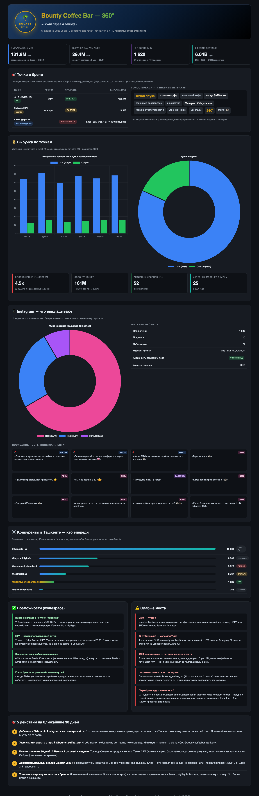
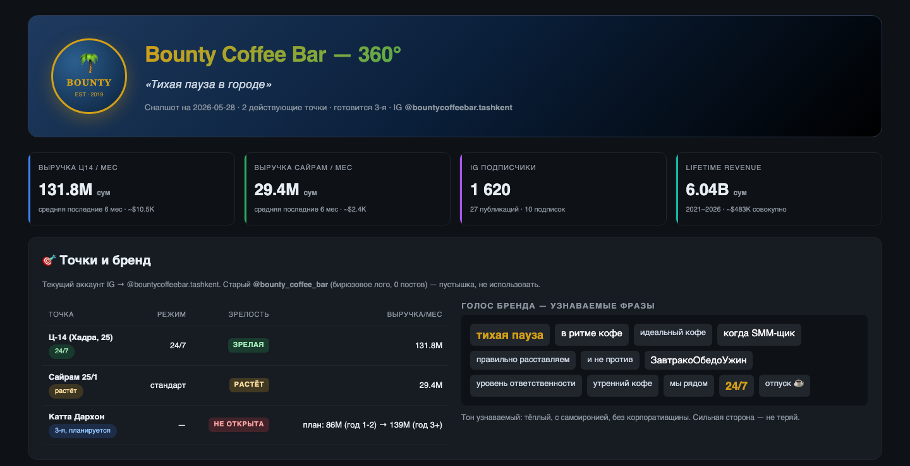
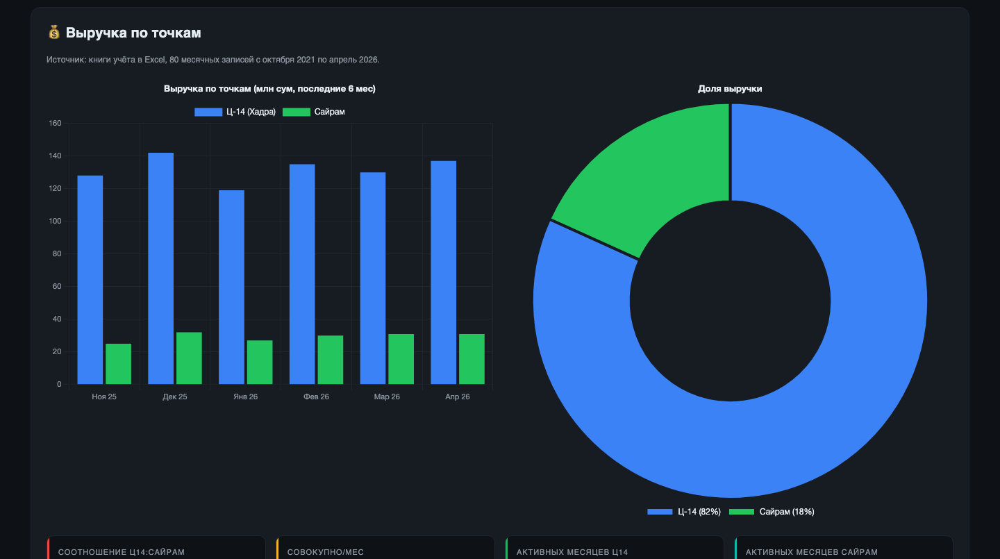
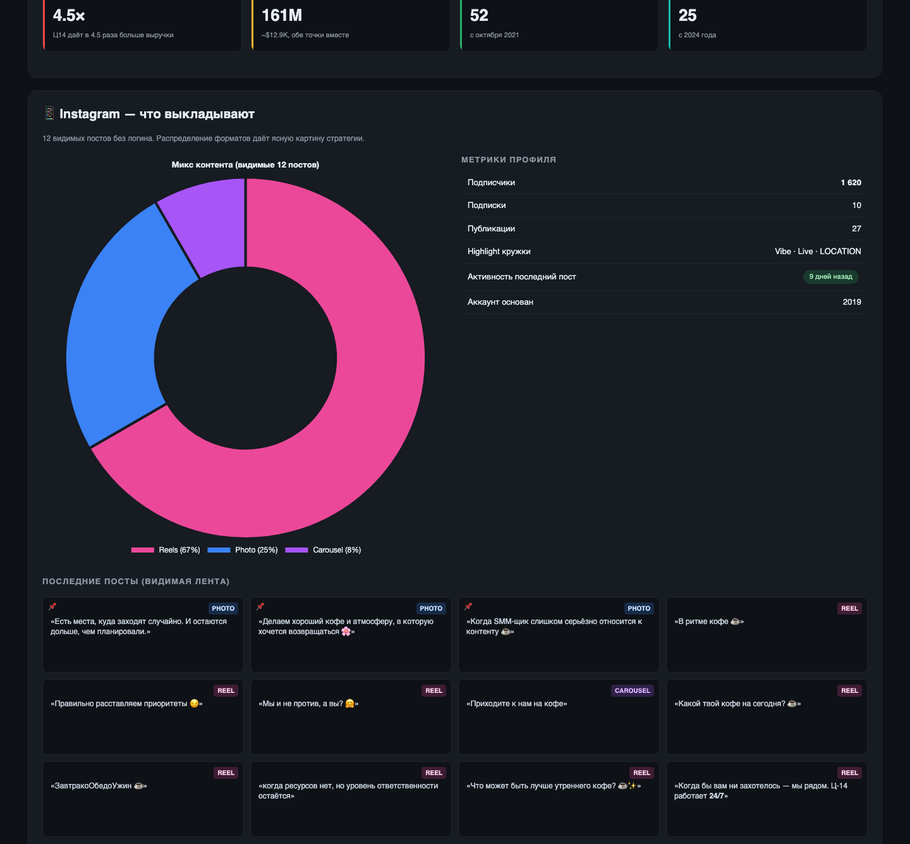
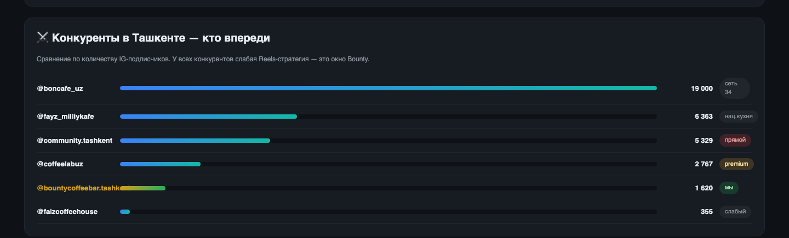
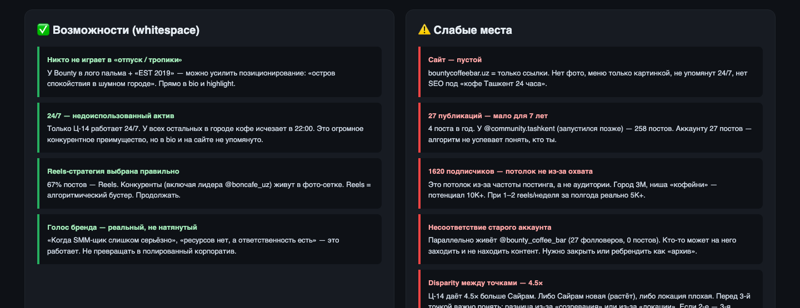
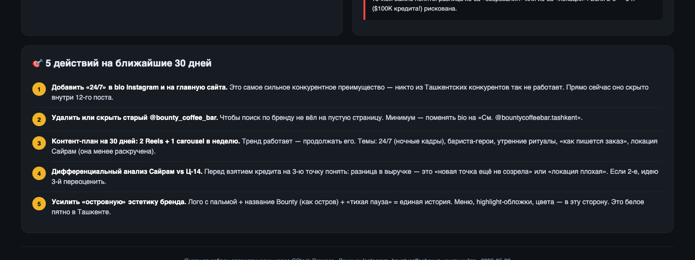

# Bounty Coffee Bar — 360° анализ
**Снапшот: 2026-05-28** · Собран автоматически через GStack Browser
Источники: Instagram @bountycoffeebar.tashkent · bountycoffeebar.uz · книги учёта 2021–2026

---

## Интерактивный дашборд

Файл: [`bounty-360-2026-05-28.html`](./bounty-360-2026-05-28.html)
Открой в любом браузере — диаграммы Chart.js, hover-эффекты, dark-theme.

---

## Полный снимок дашборда

---

## Секция 1 — Бренд, точки, ключевые метрики

**Что показано:**
- Лого-плейсхолдер (тёмно-синий круг с пальмой) + тэглайн «Тихая пауза в городе»
- 4 верхние KPI-карточки: выручка Ц14 (131.8M) / Сайрам (29.4M) / IG подписчики (1620) / lifetime выручка (6.04B сум)
- Таблица 3 точек со статусами (зрелая / растёт / планируется)
- Word-cloud узнаваемых фраз из IG-постов

**Главная находка:** Ц-14 работает **24/7**, но это нигде не подсвечено в bio и на сайте — упущенный актив.

---

## Секция 2 — Финансы по точкам

**Что показано:**
- Bar chart выручки по месяцам (ноя 2025 — апр 2026)
- Donut доли выручки (Ц-14 = 82%, Сайрам = 18%)
- 4 финансовых KPI: соотношение 4.5×, совокупно 161M/мес, активных месяцев

**Главная находка:** Ц-14 даёт **в 4.5 раза** больше Сайрама. Перед взятием кредита $100K на 3-ю точку обязательно понять — это из-за зрелости (Сайрам активен 25 мес vs 52 у Ц-14) или плохая локация. Если 2-е, идею 3-й нужно переоценить.

---

## Секция 3 — Instagram-стратегия

**Что показано:**
- Donut контент-микса (Reels 67% / Photo 25% / Carousel 8%)
- Метрики профиля (1620 подписчиков, 27 постов, 10 подписок, highlight-кружки)
- Сетка 12 последних постов с типом каждого

**Главная находка:** Reels-стратегия выбрана осознанно — это **правильно** для алгоритма Instagram 2026. Но 27 постов за 7 лет = 4 в год — недостаточно для роста охвата. Нужна частота: 2 reels + 1 carousel в неделю.

---

## Секция 4 — Конкуренты в Ташкенте

**Что показано:**
- Bar chart 6 IG-конкурентов по числу подписчиков
- @bountycoffeebar.tashkent (1620) подсвечен золотым — пятое место из 6

**Главная находка:** До прямого конкурента @community.tashkent (5329) — **3.3× разрыв**, но он копит фолловеров 3+ года с другой стратегией (фото-первый). Поскольку у всех конкурентов Reels слабее — окно для Bounty открыто.

---

## Секция 5 — Возможности и слабые места

**4 возможности (whitespace):**
1. Никто не играет «отпуск / тропики» — у Bounty уже пальма в лого
2. 24/7 = недоиспользованный актив (только Ц-14 в городе)
3. Reels-стратегия выбрана правильно — продолжать
4. Голос бренда живой и узнаваемый — не корпоративить

**5 рисков:**
1. Сайт пустой — только ссылки, нет SEO под «кофе 24/7 Ташкент»
2. 27 публикаций за 7 лет — алгоритм не успевает понять, кто ты
3. 1620 подписчиков = потолок из-за частоты, не из-за аудитории (город 3M)
4. Старый @bounty_coffee_bar (27 фолловеров, 0 постов) сбивает поиск
5. **Disparity точек 4.5×** — кредит $100K на 3-ю до понимания причины — риск

---

## Секция 6 — План действий на 30 дней

**ТОП-5 действий:**
1. **Добавить «24/7» в bio IG + на главную сайта** — главный недоиспользованный актив
2. **Удалить или скрыть старый @bounty_coffee_bar** — чтобы поиск не вёл в пустоту
3. **Контент-план 30 дней: 2 Reels + 1 carousel в неделю** — темы: 24/7, бариста, утро, Сайрам
4. **Дифференциальный анализ Сайрам vs Ц-14** — перед кредитом на 3-ю точку
5. **Усилить «островную» эстетику** — пальма + Bounty + «тихая пауза» = единая история

---

## Файлы проекта

| Путь | Что |
|---|---|
| `~/Desktop/Bounty/design/data/bounty-snapshot-2026-05-28.json` | Все собранные данные в одном JSON |
| `~/Desktop/Bounty/design/dashboards/bounty-360-2026-05-28.html` | Интерактивный дашборд |
| `~/Desktop/Bounty/design/dashboards/REPORT-2026-05-28.md` | Этот отчёт |
| `~/Desktop/Bounty/design/dashboards/screenshots/*.png` | 7 скриншотов (00-full + 6 секций) |

---

*Скриншоты сгенерированы через headless Chromium, 1440px ширина, ноябрь-апрель из книг учёта Excel.*
